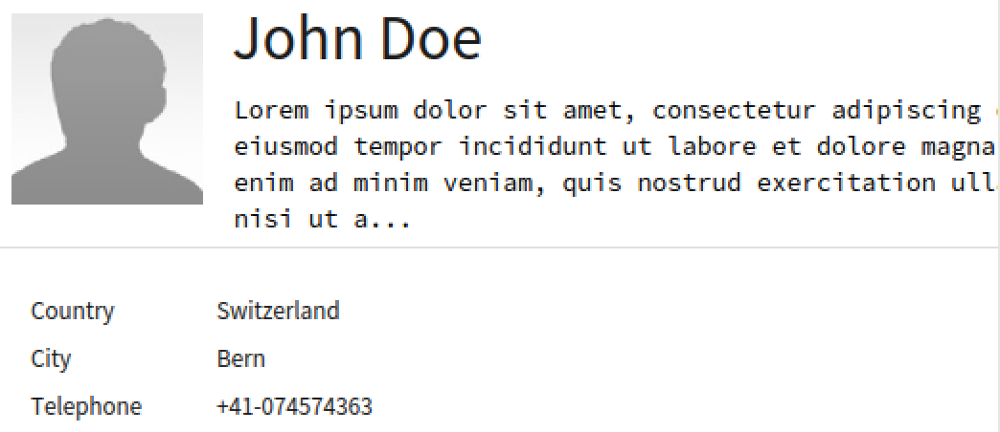

Address books are instances of the class `DmAbAddressBook `.

```Smalltalk
DmAbAddressBook new
    label: 'My contacts'. 
```

Contacts are then instances of `DmAbContact `. They can have several properties, like name, address, description:

```Smalltalk
DmAbContact new
    firstName: 'Jane';
    lastName: 'Doe';
    description: 'Lorem Ipsum';
    avatar: DmAbContact johnDoeAvatar;
    address: (DmAbAddress new
        city: 'Bern';
        country: 'Switzerland';
        telephone: (DmAbTelephone new 
            prefix: '41'; 
            number: '074574363')).
```

This contact will be displayed then in the user interface as follows:



Contacts can be added using the `GtABAddressBook>>#addContact:`:

```Smalltalk
anAddressBook := DmAbAddressBook new
    label: 'My contacts'.
anAddressBook addContact: (DmAbContact new
    firstName: 'Jane';
    lastName: 'Doe').
anAddressBook addContact: (DmAbContact new
    firstName: 'John';
    lastName: 'Doe')
```
